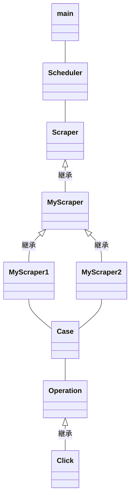

# pynium-template

python+Seleniumを簡単に使えるようにラッピングしたもの

# 機能とか
* マルチスレッド実行に対応
* クリック、セレクトボック等々のブラウザ操作をラッピング
* スクショ保存、HTML保存、スマホサイズでの実行等をUtil化
* dockerで実行できるようにheadless化やその他オプションも設定済み
* Scraperインターフェースに沿って作れば、スクレイピング対象のサイトが増えても保守性が損なわれにくい
  * スクレイプしたデータをDBに入れるとか、テキストに書き出すとかを共通化して記述できる